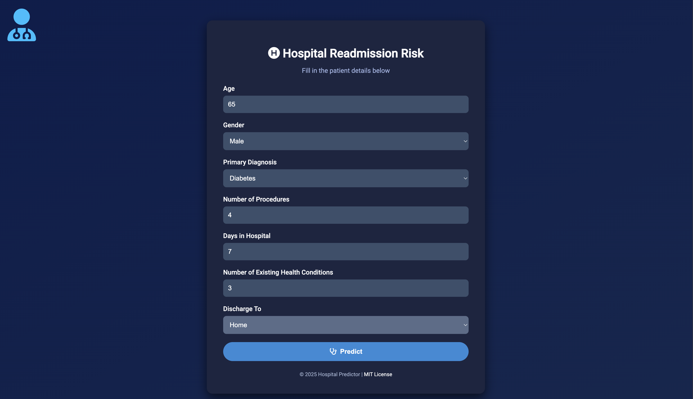
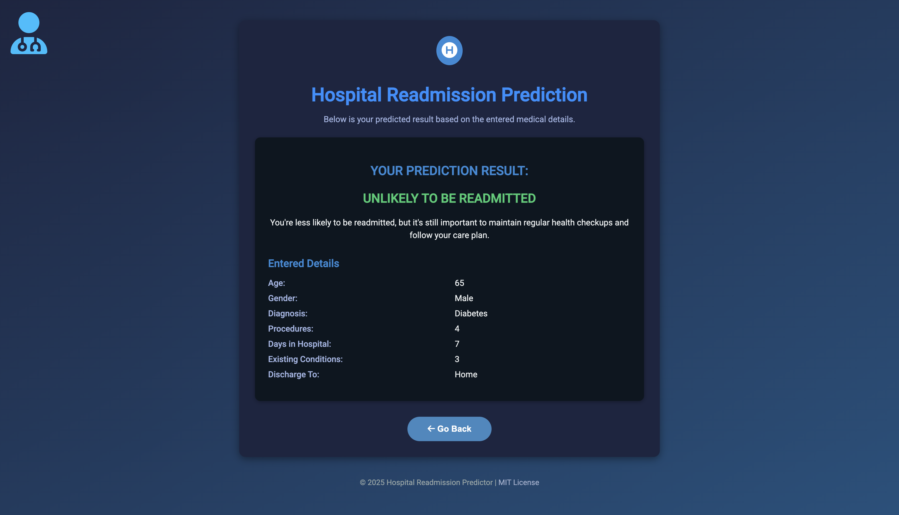

# 🚀 Machine Learning Projects by Trevin07

Welcome to my Machine Learning repository!  
Here, you'll find a collection of hands-on projects where I explore real-world problems using popular ML techniques. The notebooks cover data preprocessing, training models, evaluating performance, and sometimes even deployment.

---

## 📁 Project Highlights

### 📊 `cost_estimator`
An ML model that estimates the cost of living based on inputs like housing, food, healthcare, etc.  
✔️ Includes model training, predictions, and deployment-ready Flask app.

### 🏠 `Predicting house prices using regression.ipynb`
Predicts house prices using regression techniques.  
Good example of feature selection and model tuning.

### 📈 `stock-market-predictor.ipynb`
Predicts stock market trends using machine learning techniques.  
Focus on regression models and time series analysis.

### 💼 `income_predictor`
Predicts if a person’s income is above or below a certain threshold using demographic and financial features.  
Includes label encoding, model evaluation, and export using `joblib`.

### 🔍 `EDA on a dataset using K-NN.ipynb`
Performs Exploratory Data Analysis and applies the K-Nearest Neighbors algorithm to a classification problem.

### 🔐 `Fraud Detection Using Support Vector Machines.ipynb`
Uses SVM to detect fraudulent activities in a financial dataset.

### 📚 `fcc_book_recommendation_knn.ipynb`
A book recommendation system using collaborative filtering with KNN.

### 📱 `fcc_sms_text_classification.ipynb`
Classifies SMS messages as spam or ham using Natural Language Processing and Machine Learning.

### 🌳 `Machine learning - Decision Trees.ipynb`
Demonstrates how decision trees work with examples and visualizations.
---

## 🛠 Tech Stack

- **Languages**: Python  
- **ML Libraries**: scikit-learn, pandas, NumPy, matplotlib, seaborn  
- **Frameworks**: Flask (for deployment)  
- **Other Tools**: Jupyter Notebook, joblib, LabelEncoder  

## 📌 Topics Covered  
- 🔹 **Regression & Classification** (Linear Regression, Logistic Regression, SVM, Decision Trees, etc.)  
- 🔹 **Neural Networks & Deep Learning** (TensorFlow, PyTorch, CNNs, NLP)  
- 🔹 **Unsupervised Learning** (K-Means, PCA, Clustering)  
- 🔹 **Feature Engineering & Data Preprocessing**  
- 🔹 **Model Optimization & Hyperparameter Tuning**  
- 🔹 **End-to-End ML Pipelines & Deployment**  

